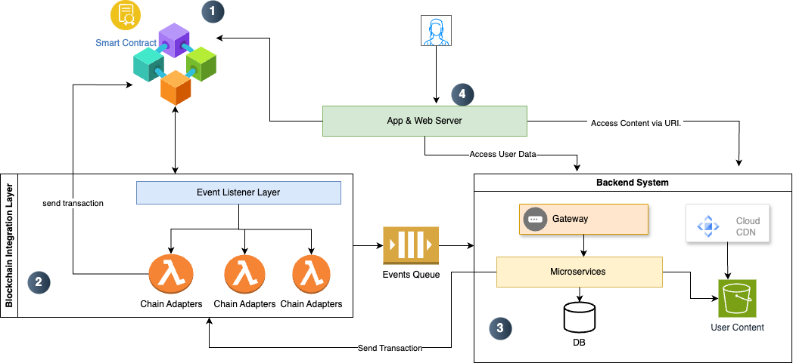

# Decentralized Content Sharing System Design

This solution features an infrastructure which helps curators, content creators, artists and users across the globe to share content which is verified, transparent, secured, rewardable and fast.

## Contents
- [Overview](##Overview)
- [Introduction](##Introduction)
  - [Purpose and Scope](##Purpose-and-scope)
  - [System Overview](##System-Overview)
  - [Functional Requirements](##Functional-Requirements)
  - [Non-Functional Requirements](##Non-Functional-Requirements)

## Overview

The System Design Document describes the system requirements, operating environment, system and subsystem architecture, files and database design, input formats, output layouts, human-machine interfaces, detailed design, processing logic, and external interfaces.

## Introduction
 
### Purpose and Scope
Purpose of this document is to provide a high level design idea for a decentralized infrastrucure.
The scope is limited to High level Design(HLD) providing a blueprint of a design choice keeping mentioned constraints in mind. The document doesn't bring focus on in depth view or low level design choices. 

### Functional Requirements
This new infrastructure should enable:

1. Decentralized storage of user data and account balances.
2. Verification and validation of produced data without a central entity.
3. Transparent and secure management of cryptocurrency payments.
4. On-chain tracking of all interactions (data production, verifications, votes, etc.) to ensure complete traceability.
5. User Registration and Authentication

### Non-Functional Requirements

1. High Availability of the environment
2. Near real time data governance
3. High throughput
4. Performant application

### System Overview

The System is designed utilizing below patterns & architecure style:
- Event Driven Architecture
- Microservices
- Adapter pattern
- SOLID principles

The key areas to the architecture are

1. <b>Blockchain Resource(s)</b>: The main attribute to Decentalized Apps( from here on dApp) is keeping transparency of data. Keeping data and transactions onchain utilizing smart contract technology will provide transparency, security, traceability to the system.
2. 