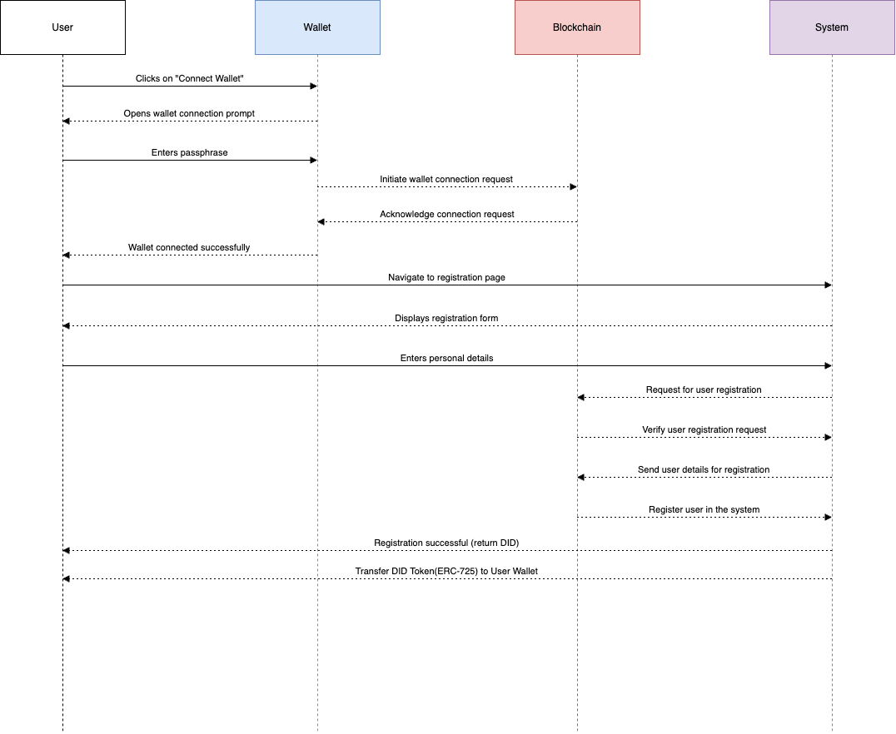

# Decentralized Content Sharing System Design

This solution features an infrastructure which helps curators, content creators, artists and users across the globe to share content which is verified, transparent, secured, rewardable and fast.

## Contents

- [Overview](#overview-anchor)
- [Introduction](#Introduction)
  - [Purpose and Scope](#Purpose-and-scope)
  - [Functional Requirements](#Functional-Requirements)
  - [Non-Functional Requirements](#Non-Functional-Requirements)
  - [System Overview](#System-Overview)
  - [Design Constraints](#Design-constraints)
- [System Architecture](#system-architecure)
  - [Design Choices](#design-choices)
  - [Detailed Architecutre and flows](#architecture-details)

## Overview 

The System Design Document describes the system requirements, operating environment, system and subsystem architecture, files and database design, input formats, output layouts, human-machine interfaces, detailed design, processing logic, and external interfaces.

## Introduction 

### Purpose and Scope 

Purpose of this document is to provide a high level design idea for a decentralized infrastrucure.
The scope is limited to High level Design(HLD) providing a blueprint of a design choice keeping mentioned constraints in mind. The document doesn't bring focus on in depth view or low level design choices.

### Functional Requirements 

This new infrastructure should enable:

1. Decentralized storage of user data and account balances.
2. Verification and validation of produced data without a central entity.
3. Transparent and secure management of cryptocurrency payments.
4. On-chain tracking of all interactions (data production, verifications, votes, etc.) to ensure complete traceability.
5. User Registration and Authentication

### Non-Functional Requirements 

1. High Availability of the environment
2. Near real time data governance
3. High throughput
4. Performant application

### System Overview 

The System is designed utilizing below patterns & architecure style:

- Event Driven Architecture
- Microservices
- Adapter pattern
- SOLID principles

The key areas to the architecture are

1. <b> Blockchain Resource(s): </b> The main attribute to Decentalized Apps( from here on dApp) is keeping transparency of data. Keeping data and transactions onchain utilizing smart contract technology will provide transparency, security, traceability to the system.
2. <b>Blockchain Integration Layer:</b> Integration layer provides better control & maintainibility for the code that needs interaction with blockchain(s). For example: Capturing contract events to index them for faster executions, Sending transaction to chain, etc. This layer follows adapter pattern to integrate with various chains including EVM and Non-EVM, <i>hence makes the solution dynamic and extensible</i>.
3. <b>Baceknd System :</b> To cater to users and there accounts, there content, there rewards and all information which is required to be served over App, Web or other client based methodolgy, a scalable backend system is required. The backend system is build on microservices architecure serving on chain data and other static information to user in quick time without making expensive calls to chains or other resources.
4. <b>App & Web Layer: </b> A Front end layer which connects to backend system or blockchain for send transaction or retrieving data to serve the end user.

### Design Constraints 

There can be maitainance overhead for maintaining different adapters, but that is a tradeoff to be more dynamice and scalable to n chains.
Whole system is more close to on chain event and does a lot of processing based on on-chain data. There are chances of these events become irregular and can become challenging. But, it makes the whole system more real time and in sync with onchain.

## System Architecture 

The whole system architecture is divided into 3 important aspects:

- <i>Decentralized Infrastructure </i>:
  - To store content shared by users in a transparent ways
  - To Validate, verify and track of content added/modified, votes, rewards etc.
  - To transfer rewards
- <i>An Event Driven Backend System</i>: The bacekdn system helps as an auxialry services to help providing faster access to data for better user expereiences. Being event diven along with microservice architecture in nature helps make the whole system modular, scalable and adapt to changing business needs more swiftly.
- <i>Mix of Web3 & Web2 Coomunication</i>: Use of Web3 involves browser based encrypted communication to on chain transaction which is then supported by traditional Web2 technologies like HTTP, REST, Pub/sub based mechanisms helps in making communication secured and advanced.

### Design Choices 

1. <i>Blockchain Network(s)</i>: Selecting the most suitable blockchain for a decentralized infrastructure involves considering factors such as scalability, transaction costs, ecosystem support, and interoperability. Here are a few blockchain platforms that are well-suited for handling decentralized data management, verification, and rewards, along with their pros and cons:
    | Chain | Pros | Cons |
    | :---   | :---  |  :--- |
    | `Ethereum` |  <ul><li>Mature Ecosystem</li><li>Smart Contract Flexibility</li> <li>Interoperability</li></ul>  |  <ul><li>High Gas fee</li> <li>Slower transaction time</li> </ul>  |
    | `Polygon`   | <ul><li>ower gas fees and faster transactions.</li><li>Smart Contract Flexibility</li> <li>Interoperability</li><li>Scalability</li>   </ul> | <ul><li>Depends on Ethereum Security</li>  </ul> |
    | `Solana`   | <ul><li>Low Transaction Fees.</li><li>High Performance</li> </ul>  | <ul><li>Depends on Ethereum Security</li>  </ul> |

    Being dynamic in nature, the system can grow to various other chains like, Arbitrum, Optimism, etc.

2. <i>Data Storage</i>: For building a fully decentralized infrastructure that eliminates the middleman and increases trust, we need to carefully select storage solutions that meet below requirements:

    - Decentralized storage: Data should not reside in a single location.
    - Immutability: Data should be tamper-proof.
    - Verifiability: Data integrity and authenticity should be verifiable.
    - Transparency: Data should be accessible for auditing and verification.
    - Efficiency: Data access and retrieval should be efficient.

    Given the requirements, a hybrid approach combining multiple decentralized storage technologies is optimal:

    <h4>Combining IPFS and Arweave</h4>
    IPFS

        - Decentralized: Data is distributed across a network of nodes.
        - Immutable: Data is content-addressed, meaning it is retrieved using a unique hash, ensuring data integrity.
        - Efficient: Only the necessary data is retrieved, reducing redundancy.
        - Wide Adoption: Well-supported by the decentralized application (dApp) ecosystem.
    Arweave:

        - Permanent Storage: Once data is stored, it is permanent and immutable.
        - Decentralized: Data is distributed across a network of nodes.
        - Cost-Efficient in the Long Run: One-time payment for permanent storage.
        - Scalability: Designed to handle large-scale data storage needs.

    Decentralized Storage of User Data and Account Balances:

    - IPFS provides decentralized, content-addressable storage, ensuring data integrity.
    - Arweave ensures that critical data is permanently stored and immutable, enhancing security and trust.
      

    Verification and Validation of Produced Data:

    - IPFS allows verifiers to access the data efficiently using content hashes.
    - Arweave ensures that verification results and related metadata are permanently stored and immutable, supporting transparent validation processes.
      

    Transparent and Secure Management of Cryptocurrency Payments:

    - Use smart contracts on a blockchain (e.g., Polygon) to manage payments securely.
    - Store transaction metadata on Arweave for permanent, tamper-proof records.
      
    
    On-Chain Tracking of All Interactions:

    - Record all interactions (data production, verifications, votes, etc.) on the blockchain for complete traceability.
    - Use IPFS to store detailed interaction data, with references (content hashes) stored on the blockchain.
    - Ensure critical interaction records are also stored on Arweave for permanence.

### Detail Architecutre and flows 

1. User Registration:

   

   - User enters the system, system prompts for wallet connect.
   - Once user connects with the wallet and the connection is succesful
   - Our system takes user to a registration journey.
   - User enters the required details, necessary as per system requirements.
   - Upon sucessful data collection, system generates a Digital Identity(DID) in the form of a ERC-725 issued with DID and the data hash of what is entered in the system.
   - Following this, whenever user connects with the wallet to the system, system acknowledges the user with the help of DID and fetch data from data hash.

  > [!NOTE]  
  > Use of ERC725 standard, helps creating a soverign identity which help tracks the user onchain. Keeping data offchain and dataHash aalong with DID guarantees authenticity and transparency.

2. Data 